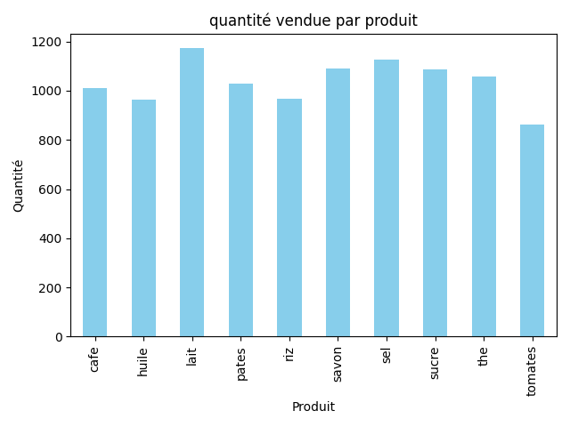
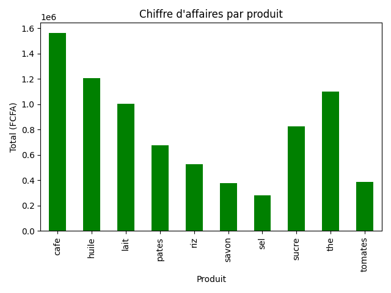
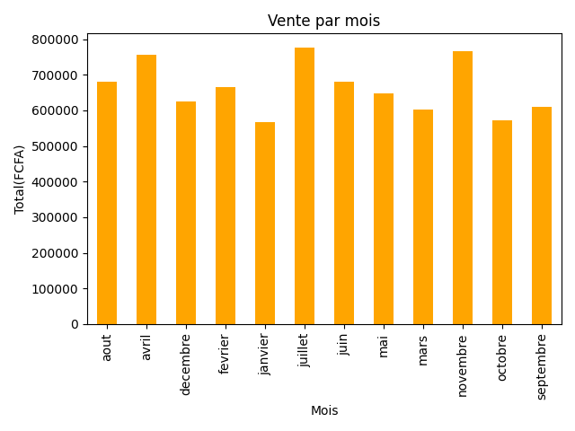

# 🛒 Analyse des ventes d’un magasin

## 📌 Objectif
Ce projet consiste à analyser les données de ventes d’un magasin afin de :
- identifier les produits les plus vendus
- déterminer les mois les plus rentables
- calculer le chiffre d'affaires

---

## 📊 Description du dataset
Le dataset contient les colonnes suivantes :
- **produit** : nom du produit
- **prix** : prix du produit
- **quantite** : quantité vendue
- **mois** : mois de la vente

---

## 🧰 Outils utilisés
- Python 🐍
- Pandas
- Matplotlib

---

## 📈 Analyses réalisées
- Calcul du chiffre d’affaires (prix × quantité)
- Analyse des ventes par produit
- Analyse des ventes par mois

---

## 📊 Visualisations
### 🛒 Quantité vendue par produitt


### 💰 Chiffre d'affaires par produit


### 📅 Ventes par mois 


## Exemple de résultats
- Produit le plus vendu : (lait       1173)
- Mois le plus rentable : (ajuillet      776987)


---

## ▶️ Comment exécuter le projet

1. Cloner le projet :
```bash
git clone https://github.com/junisselassock3-cell/analyse-vente-magasin.git
